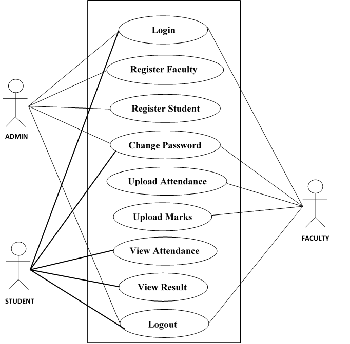
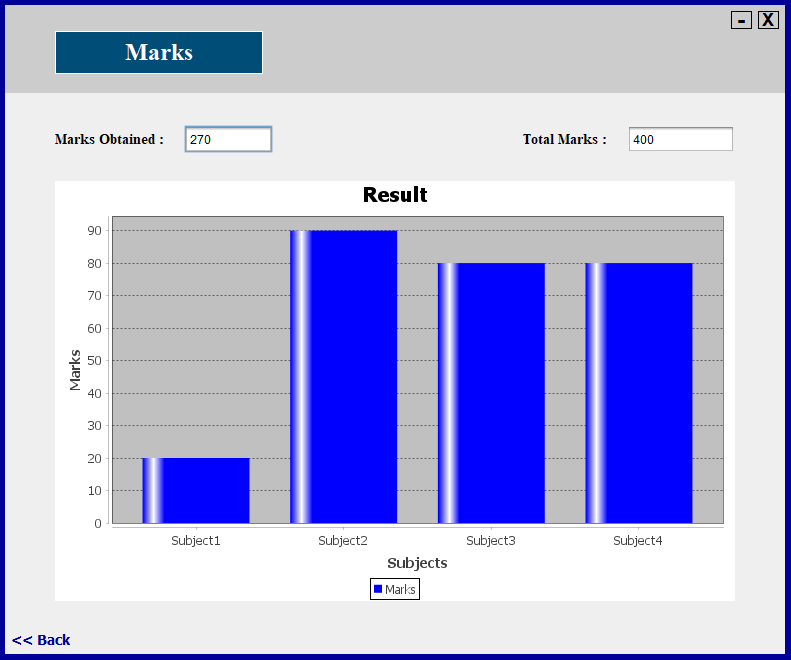

# Student-Information-System
The <b>STUDENT INFORMATION SYSTEM</b> allows authorized members to access the records of academically registered students. It can be used in various educational institutes across the globe and simplifies working of institutes.
  

## Languages used
<ul>
  <li>Java</li>
  <li>SQL</li>
</ul>

## Modules in Student Information System
- Admin Module
- Faculty Module
- Student Module

## Features
- Admin can register faculty and student
- Faculty can upload marks and attendance of students
- Student can view their marks and attendance

